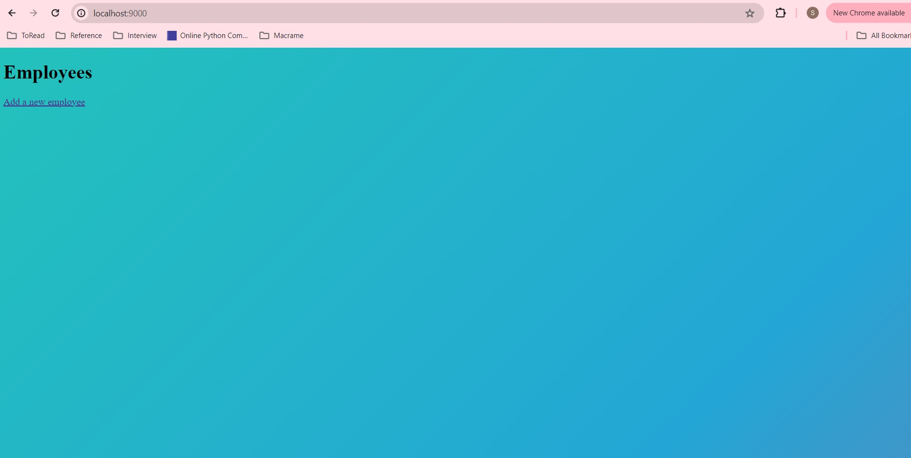
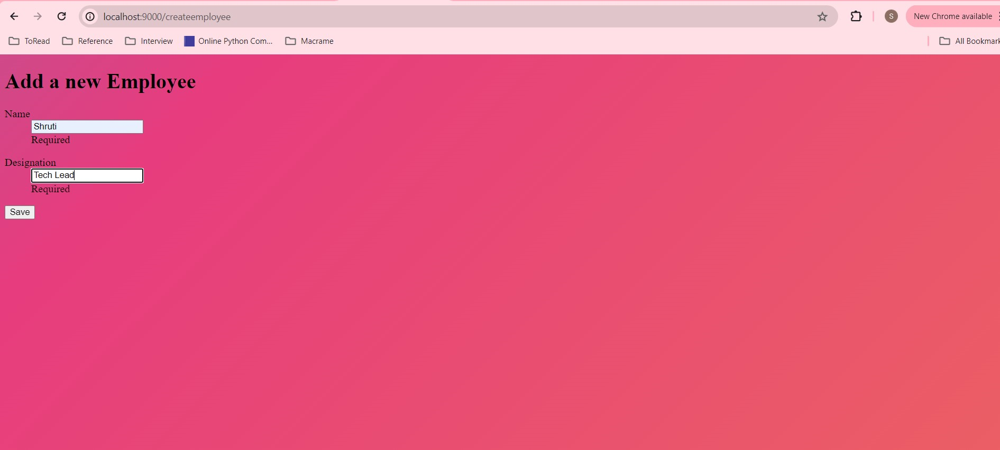
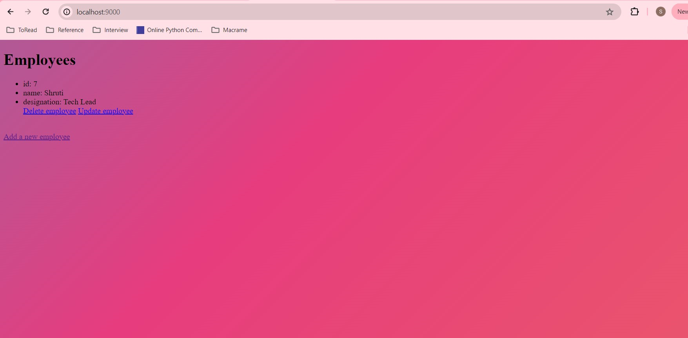
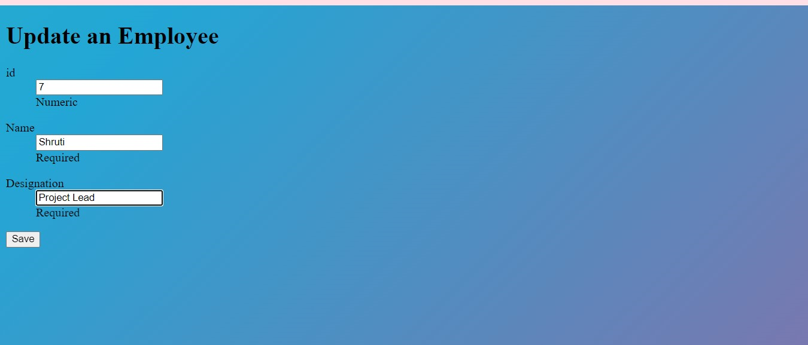

**Objective**

This is very basic Scala Play project which provides CRUD operations
in postgres DB which can be visualized on simple UI. 
It uses scalikejdbc JDBC library for data access layer.

**Prerequisites**

1. sbt >= 1.9.8 (https://www.scala-sbt.org/1.x/docs/Setup.html)
2. Postgres >= 15.6 (https://www.postgresql.org/download/)

**How to run**

1. Clone this repo
2. Update Ppostgres username and password in application.conf file.
3. Create _employees_ table by running below SQL script in Postgres

   `create table employees(id serial primary key, name text, designation text)`

4. Run 'sbt compile' in terminal from project directory 
5. Run 'sbt run' and access localhost:9000 

**UI**

1. Home page

2. Add employee

After:

   

3. Update employee

